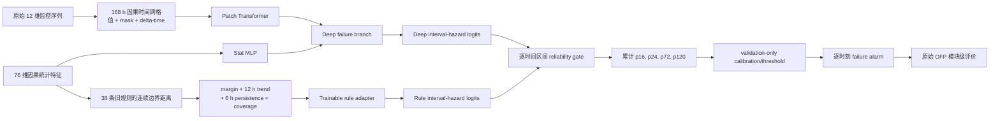

# Deep-Rule Optical Failure Prediction（DRFP-Net）

这个目录是一套独立、可运行、可消融的新 OFP 实现。论文任务固定为 **Optical Module Failure Prediction**；它不是异常检测，也不把深度表示再交给 XGBoost。

## 1. 模型做什么

DRFP-Net 同时学习两条可以独立评价的分支：



- Deep branch：原始 12 维时序 + 76 维统计特征，直接预测未来故障风险。
- Rule branch：把 Model2 的 38 条启用规则转换为连续、可学习的规则信号，而不是等规则真正触发后才输出 1。
- Fusion：在 4 个时间区间的 hazard-logit 层分别学习规则可靠性，再构造累计故障概率；单调性 `p16 ≤ p24 ≤ p72 ≤ p120` 由模型结构保证。
- 主决策出口：校准后的 `p120`。`p16/p24/p72` 是辅助 Failure Prediction 监督和诊断，不参与投票。

这里的 Rule branch 是“基于规则信号的神经适配器”，不是保持数学单调性的硬 RuleModel。旧硬规则仍可作为外部 legacy baseline，但不能把当前可训练分支描述成同一个算法。

## 2. 冻结的 OFP 协议

- fold 3 是唯一测试集：4458 个模块，其中 1368 个故障模块。
- fold 1+2 先固定为 development pool，再按模块、按标签以 seed 42 划分：8022 train + 892 validation。
- 不进行 3-fold 训练或结果池化。
- 首次 `anomaly > 0` 是故障时刻；训练只使用严格早于它的 endpoint。
- 训练目标是未来 16/24/72/120 小时累计 Failure Prediction 标签。
- 原始 OFP 评价保持不变：故障模块只要首次报警严格早于故障就命中；正常模块任意报警都是 FP。
- `avg_lead_hour = 命中模块提前量之和 / 全部故障模块数`，漏报自动贡献 0。
- `final_score = F1 + Accuracy + tanh(AvgLead) + tanh(MinLead)`。

需要诚实区分两个层次：`p120` 是点级固定窗口训练代理，而原始 OFP 会奖励任意故障前报警，包括提前超过 120 小时的报警。因此训练目标和模块级评价并非数学等价；v1 为了和 Model1 保持标签可比性，明确保留了这个既有设定，没有暗中改 evaluator，也没有加入会改变主损失的 MIL warning head。

## 3. 快速验证

从服务器的 AIOPS 根目录运行：

```bash
pip install -r OFP/unified_baseline/deep_rule_ofp/requirements.txt

python -B OFP/unified_baseline/deep_rule_ofp/run_experiment.py \
  --smoke \
  --device cuda \
  --data-dir dataset/training \
  --index-path 'dataset/train_test_set_index(in).csv' \
  --output-dir OFP/unified_baseline/deep_rule_ofp/artifacts/smoke
```

没有 GPU 时将 `--device cuda` 改为 `--device cpu`。Smoke 只验证数据、shape、训练、校准、阈值、评价和产物闭环，其小样本分数不是正式结果。

## 4. 正式训练完整模型

```bash
python -B OFP/unified_baseline/deep_rule_ofp/run_experiment.py \
  --device cuda \
  --data-dir dataset/training \
  --index-path 'dataset/train_test_set_index(in).csv' \
  --output-dir OFP/unified_baseline/deep_rule_ofp/artifacts/main_formal
```

如果推理阶段显存不足，可在命令中加入 `--inference-batch-size 256`；这只改变分批大小，不改变样本、模型或评估协议。

测试推理会按模块小批读取 fold3，不会一次性创建上千万个 endpoint 对象。首次运行不要加 `--overwrite`；确认需要重跑同一输出路径时再加，程序会重建预测目录以避免旧 CSV 残留。

## 5. 一条指令运行全部架构消融

```bash
python -B OFP/unified_baseline/deep_rule_ofp/run_suite.py \
  --device cuda \
  --data-dir dataset/training \
  --index-path 'dataset/train_test_set_index(in).csv' \
  --artifacts-dir OFP/unified_baseline/deep_rule_ofp/artifacts
```

五个变体只改变 architecture：

| ID | 输入/融合 | 回答的问题 |
| --- | --- | --- |
| D0_temporal_only | Raw temporal | 深度时序本身是否有效？ |
| D1_deep_raw_stat | Raw temporal + Statistical | 76 维统计信息是否补充时序表示？ |
| D2_rule_only | Rule signals | 专家规则信号能否独立预测故障？ |
| D3_fixed_fusion | Deep + Rule，固定 0.5 融合 | 简单平均是否足够？ |
| D4_gated_fusion | Deep + Rule，可靠性门控 | 自适应规则参与是否优于固定融合？ |

只跑部分变体：

```bash
python -B OFP/unified_baseline/deep_rule_ofp/run_suite.py \
  --device cuda \
  --experiments D1_deep_raw_stat D2_rule_only D4_gated_fusion \
  --data-dir dataset/training \
  --index-path 'dataset/train_test_set_index(in).csv' \
  --artifacts-dir OFP/unified_baseline/deep_rule_ofp/artifacts_partial
```

## 6. 如何看结果

单模型目录包含：

- `branch_comparison.csv`：Deep、Rule、Fusion 各自的 fixed / validation-selected 结果。
- `run_manifest.json`：配置指纹、划分、参数量、校准器、阈值、主指标和运行环境。
- `training_history.csv`：训练与 validation surrogate loss。
- `validation_threshold_search_*.csv`：只在 validation 上完成的阈值搜索。
- `module_decisions_*.csv`：模块级 TP/FP/FN/TN 和提前量。
- `ofp_predictions/*.csv`：原始 OFP 兼容的逐模块 `timestamp,predict,score` 文件。
- `model.pt`、`normalizers.json`、`calibrator.json`：复现实验所需状态。

架构 suite 目录包含：

- `comparison.csv`：每个变体同时保留 fixed threshold 与 validation-selected 两行。
- `comparison_fixed_threshold.csv`：用于查看固定 0.5 决策策略。
- `comparison_validation_selected.csv`：用于同一 validation 调阈值后的公平架构比较。
- `diagnostics.csv`：PR-AUC、Brier/ECE、lead buckets 和分支参与诊断，不挤入主表。

老师 README 的历史结果使用固定 0.5 时，fixed 表只能作为较接近的历史参考；README 的三折 pooled 测试样本和这里的单一 fold3 不同，而且这里还进行了 validation 温度校准，所以仍不能声称严格等价。严格结论要求把 Model1/XGB/Rule 等所有 baseline 放到同一 8022/892/4458 划分，并采用相同的校准与阈值流程。validation-selected 更不能直接和未调阈值的 README 数字比较。

## 7. 测试

```bash
cd OFP/unified_baseline/deep_rule_ofp
python -m pytest -q
```

详细特征定义见 [FEATURES.md](FEATURES.md)，严格评价与泄漏边界见 [PROTOCOL.md](PROTOCOL.md)，论文证据和后续实验见 [EVIDENCE_PLAN.md](EVIDENCE_PLAN.md)。
