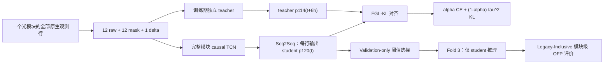

# Deep Rule OFP v2：Native Seq2Seq + Future-Guided Learning

> 当前默认模型已升级为 **Rule-Guided Residual + validation-safe Rule fallback**。架构、保证边界、运行命令和审计产物见 [`RULE_SAFE_RESIDUAL.md`](RULE_SAFE_RESIDUAL.md)。

下文关于 N0/N1 的章节保留了原始纯时序 CE/FGL 实验设计，便于复现实验历史；其中“只使用 25 维时序输入、不加入规则”的描述仅对应 `--architecture causal_depthwise_tcn --disable-safe-rule-fallback` 对照。当前 `configs/default.json` 会额外输入 38 维 causal rule margins 及 mask，并在 validation 上冻结 canonical Rule-only 或 residual 决策源；它不声称逐字节复刻旧 Model2 的缺失值/删行 quirks。

本目录是一套面向光模块 **Failure Prediction（故障预测）** 的独立升级实现。运行时只依赖本目录内的 `fgofp` 包，不依赖同级的 `ofp_unified` 或旧 baseline 源码。它不会覆盖、迁移或静默改变旧版 [`../deep_rule_ofp`](../deep_rule_ofp)；旧版结果仍按旧版配置解释，新旧目录的模型、协议和产物不能混用。

原始 N0/N1 子实验刻意只回答一个问题：在 OFP 的模块级评价下，原生约 5 分钟因果深度模型能否从 Future-window CE 进一步受益于 FGL；`run_suite.py` 已显式锁定纯时序架构并关闭规则回退。当前默认 N2 则回答另一个独立问题：causal rule margins 能否正向修正时序模型，并由 validation-safe canonical Rule Model 提供全局兜底。两条实验线不得混写为同一个消融轴。论文主训练协议仍为 `legacy_inclusive_v1`；全量三折入口同时输出独立冻结决策源的 `ofp_original_strict_v1` 兼容评估行。

> 重要说明：本文档定义的是可复现实验协议，不代表模型已经获得提升，也不代表 FGL 本身是本工作的原创方法。FGL 的方法依据来自 [A predictive approach to enhance time-series forecasting](https://www.nature.com/articles/s41467-025-63786-4)。

## 1. 整体架构



核心约束如下：

- 输入保持原始 12 个监控量，不再构造统计特征或专家特征。
- 每个 CSV 的每个真实观测行对应一个序列步；不做小时聚合、不重采样、不插值、不补造时间点，也不删除正常观测行。
- 一个完整模块构成一条变长序列。批处理只会在张量尾部做带 mask 的计算填充，填充位置不参与损失或决策。
- 训练时故障模块在首故障行后截断，因为这些行既不属于 Failure Prediction 监督，也不可能因果影响更早输出；validation/test 决策推理仍保留并输出原文件的全部行。
- causal TCN 在每一行输出二分类 logits，故障类 softmax 概率记为 `p120(t)`；该输出只依赖当前行及历史行。
- teacher 只在训练阶段提供 FGL 软目标；验证、测试和最终部署全部只运行 student。

## 2. 原生序列输入

模型每一行固定接收 25 维输入：

1. `12 raw`：temperature、current、主通道 Tx/Rx power，以及四路 Multi-Tx 和四路 Multi-Rx power；
2. `12 mask`：对应原始量在该行是否真实有效，缺失量置零但由 mask 明确告知模型；
3. `1 delta`：本行与上一真实观测行的时间差除以 300 秒，首行为 0，并按配置上限裁剪。

原始量的均值和标准差只用 train 模块中截至首故障行的有效值拟合。时间戳从读取到评价始终保存为 `int64` Unix 秒，禁止转成 `float32`，也不进行四舍五入、回拨或人为提前报警。

“原生采样频率”在这里是指保留数据实际记录的全部行，而不是强制生成严格 300 秒网格。缺测形成的较大时间间隔通过 `delta` 显式表达，因此不会凭空制造观测。

## 3. Legacy-Inclusive Future-window 标签

论文任务固定为 Failure Prediction。对故障模块，首个 `anomaly > 0` 的**行位置**定义为首故障行，其时间戳为 `T_f`。首故障行本身是有效训练行；它之后的行不参与训练损失。对任一有效行 `t`：

```text
y_H(t) = 1,  当 0 <= T_f - t <= H
       = 0,  当 T_f - t > H
```

正常模块的全部原生行均为负样本。student 的主目标使用 `H = 120 h`，输出 `p120(t)`；teacher 使用 `H = 114 h`，输出 `p114(t)`。因为区间左端包含 0，首故障行的 `p120` 报警在 `legacy_inclusive_v1` 下是合法命中，提前量记为 0。

## 4. Future-window CE + FGL-KL

训练分两个阶段：

1. 独立训练 teacher，使其逐行预测 `p114`；
2. 选择 teacher 的最佳 validation checkpoint，冻结全部 teacher 参数，再训练 student 预测 `p120`。

对 student 的时刻 `t`，在同一模块内寻找 `t + 6 h` 处的首个真实观测行作为 teacher 对齐点；只接受处于配置容差内且 teacher/student Future-window 标签一致的配对。这样：

```text
student 在 t 预测未来 120 h
teacher 在 t+6 h 预测未来 114 h
114 h + 6 h = 120 h
```

student 总损失为：

```text
L = alpha * CE(student_logits(t), y120(t))
  + (1 - alpha) * tau^2
    * KL(softmax(teacher_logits(t+6h) / tau)
         || softmax(student_logits(t) / tau))
```

默认 `alpha = 0.7`、`tau = 4.0`。CE 和 KL 都按模块归一化，避免长序列仅因行数多而支配梯度；正类权重只由 train 标签计算并受配置上限约束。teacher logits 在 KL 中会显式 detach，student 反向传播不会修改 teacher。

### 为什么默认选择 6 小时

6 小时不是未经比较就宣称的“最优提前尺度”，而是当前正式 train 划分上的覆盖率折中。不同 future offset 的审计结果如下；teacher horizon 随 offset 改为 `120 h - offset`：

| Future offset | 正 FGL pairs | 覆盖故障模块数 |
| ---: | ---: | ---: |
| 6 h | 74,868 | 357 |
| 12 h | 57,111 | 314 |
| 24 h | 39,997 | 123 |
| 48 h | 19,973 | 58 |
| 96 h | 2,596 | 38 |

较长 offset 会快速丢失可对齐的正样本和故障模块。因而 v2 默认以 6 小时作为覆盖率更充分的起点，并在运行产物中记录真实 FGL pair 覆盖；这张表支持配置选择，不构成性能提升证据。

## 5. 训练、阈值和测试读取顺序

可比流程固定为：

1. 从索引文件确定 folds 1+2 的 development pool 与 fold 3 测试成员；
2. 仅打开 train CSV，拟合标准化器并训练模型；
3. 打开 validation CSV，完成 early stopping 和 student-only 推理；
4. 只在 validation 上按 `final_score` 搜索阈值，并冻结 student checkpoint 与阈值；
5. **阈值冻结之后**才允许打开 fold 3 的模块 CSV；
6. fold 3 只运行 student，并使用冻结阈值评价一次。

故障模块的阈值候选与首次越界只使用到首故障行（含）为止的前缀；首故障之后的分数仍可写入兼容预测文件，但不会反过来影响阈值或命中判定。

索引中的测试成员信息可以提前读取，但 fold 3 的时序内容与标签不得用于标准化、训练、early stopping、FGL 配对或阈值选择。

## 6. 运行方式

在服务器的 AIOPS 根目录执行。以下命令使用本目录的命令行接口；可先运行 `--help` 查看最终可用参数。

安装正式训练依赖（优先沿用服务器已有且与 CUDA 匹配的 PyTorch；不要无意中用 CPU wheel 覆盖它）：

```bash
python -m pip install -r OFP/unified_baseline/deep_rule_ofp_v2/requirements.txt
```

仅当需要运行测试时，再安装开发/测试依赖：

```bash
python -m pip install -r OFP/unified_baseline/deep_rule_ofp_v2/requirements-dev.txt
```

先做独立导入和 CUDA 环境预检：

```bash
python -B OFP/unified_baseline/deep_rule_ofp_v2/run_experiment.py --help
python -c "import sys,numpy,pandas,torch; print(sys.executable); print(numpy.__version__,pandas.__version__,torch.__version__); print('cuda=',torch.cuda.is_available())"
```

快速闭环验证：

```bash
python -B OFP/unified_baseline/deep_rule_ofp_v2/run_experiment.py \
  --smoke \
  --device cuda \
  --data-dir dataset/training \
  --index-path 'dataset/train_test_set_index(in).csv' \
  --output-dir OFP/unified_baseline/deep_rule_ofp_v2/artifacts/smoke
```

单折正式运行默认 N2（CE + FGL + Rule-Guided Residual + safe canonical-rule fallback）。该命令只评估 fold 3 的 4,458 个模块，适合机制开发，但不能直接与 OFP 的 13,372 模块三折 pooled 历史表比较：

```bash
python -B OFP/unified_baseline/deep_rule_ofp_v2/run_experiment.py \
  --device cuda \
  --experiment-name N2_rule_guided_safe \
  --data-dir dataset/training \
  --index-path 'dataset/train_test_set_index(in).csv' \
  --output-dir OFP/unified_baseline/deep_rule_ofp_v2/artifacts/N2_rule_guided_safe
```

与 OFP 全量模块覆盖对齐的 N2 三折 out-of-fold 正式运行：

```bash
python -B OFP/unified_baseline/deep_rule_ofp_v2/run_threefold.py \
  --device cuda \
  --data-dir dataset/training \
  --index-path 'dataset/train_test_set_index(in).csv' \
  --output-dir OFP/unified_baseline/deep_rule_ofp_v2/artifacts/N2_rule_guided_safe_3fold
```

该入口依次运行三个独立 outer folds：每次以一个 fold 为测试集，从另外两个 folds 内部划出 10% validation 用于 early stopping 和当前主协议阈值选择。三个 outer-test 决策互不重叠，最终覆盖 `4457 + 4457 + 4458 = 13,372` 个模块；pooled F1、Accuracy 和 Final Score 从拼接后的模块决策重新计算，绝不平均三个折的指标。

根目录 `comparison.csv` 同时包含两行，不能混为一个排名：

- `legacy_inclusive_v1`：论文当前主协议，故障时刻报警有效；每折先在 validation 上冻结模型阈值，再从模型候选与 canonical Rule-only 中冻结最终决策源；
- `ofp_original_strict_v1`：根目录原始 `OFP/EvaluateResult.py` 兼容协议，严格故障前报警、固定阈值 0.5、提前量总和除以全部故障模块，用于和 Model1/OFP 历史结果并列。

仓库快照不能完整恢复 README 中每个历史模型的训练过程，因此第二行是**评估协议兼容结果**，不应写成对历史 XGB 训练过程的逐字复现。深度模型每折仍保留内部 validation，实际参数训练使用约 90% 的两折 development；测试模块覆盖与评价口径严格冻结，但训练样本量不应宣称与历史 checkpoint 完全相同。

三折机制 smoke（只验证流程，不能作为正式比较结果）：

```bash
python -B OFP/unified_baseline/deep_rule_ofp_v2/run_threefold.py \
  --smoke \
  --device cuda \
  --data-dir dataset/training \
  --index-path 'dataset/train_test_set_index(in).csv' \
  --output-dir OFP/unified_baseline/deep_rule_ofp_v2/artifacts/N2_rule_guided_safe_3fold_smoke
```

一条命令运行训练目标消融：

```bash
python -B OFP/unified_baseline/deep_rule_ofp_v2/run_suite.py \
  --device cuda \
  --data-dir dataset/training \
  --index-path 'dataset/train_test_set_index(in).csv' \
  --artifacts-dir OFP/unified_baseline/deep_rule_ofp_v2/artifacts/objective_suite
```

`--smoke` 只验证数据、shape、因果前向、teacher 冻结、损失、阈值和评价产物能闭环，不可把其分数写成正式结果。若重用已有非空输出目录，需要显式添加 `--overwrite`。

## 7. N0 / N1 消融

该 suite 只改变一个轴：训练目标。

| ID | student 目标 | teacher | 测试模型 | 回答的问题 |
| --- | --- | --- | --- | --- |
| N0_native_s2s_ce | Future-window CE | 不使用 | student | 原生 Seq2Seq causal TCN 的基础性能是多少？ |
| N1_native_s2s_ce_fgl | Future-window CE + FGL-KL | 训练后冻结 | student | 在模型、输入、划分和决策完全相同时，FGL 是否带来增益？ |

N0 与 N1 必须共享数据划分、标准化、TCN 架构、student epoch、模块归一化、validation 阈值策略和 Legacy-Inclusive evaluator。N1 的 teacher 参数属于训练开销，不属于部署模型参数。

## 8. 主要产物

单次实验目录至少包含：

- `effective_config.json`：实际生效配置；
- `split_manifest.csv`：模块级 train / validation / test 成员；
- `normalizer.json`：仅由 train 拟合的 12 维标准化统计；
- `training_history.csv`：teacher/student 训练与 validation 损失；
- `validation_threshold_search.csv`：validation-only 阈值候选与排序；
- `validation_module_decisions.csv`、`test_module_decisions.csv`：可审计模块级 TP/FP/FN/TN、首次报警和提前量；
- `checkpoints/student_best.pt`：可部署 student，含冻结阈值且不含 teacher 参数；
- `checkpoints/teacher_train_only.pt`：所有启用 FGL 的运行保存的训练期 teacher；
- `ofp_predictions/*.csv`：使用该折 validation-frozen 决策策略的 Legacy-Inclusive 逐模块输出；若回退到 Rule-only，则输出确定性 canonical rule 结果；
- `ofp_predictions_original_fixed_0.5/*.csv`：固定阈值 0.5、可交给根目录 `OFP/EvaluateResult.py` 复核的 strict OFP 逐模块输出；
- `result.csv`：该次所选 outer test fold 的 Legacy-Inclusive 主结果；
- `result_ofp_original.csv`：strict OFP 口径下，在 validation 独立冻结 `fixed-0.5 model score` 或 canonical Rule-only 后的兼容结果；
- `run_manifest.json`：配置/划分指纹、FGL 覆盖、读取顺序、运行环境和主指标。

三折入口额外保存 `fold_1/`、`fold_2/`、`fold_3/` 的完整单折产物，以及根目录的 `fold_metrics.csv`、`fold_metrics_ofp_original.csv`、`pooled/`、`comparison.csv` 和聚合审计 `run_manifest.json`。

添加 `--save-long-scores` 时，还会保存压缩的 `validation_scores.csv.gz` 和 `test_scores.csv.gz`。suite 汇总表应以 `comparison.csv` 为入口，直接比较 N0 与 N1。

更严格的标签、泄漏边界与模块级计分定义见 [PROTOCOL.md](PROTOCOL.md)。

紧凑的 FORT 模块消融及一键运行入口见 [MODULE_ABLATION.md](MODULE_ABLATION.md)。
