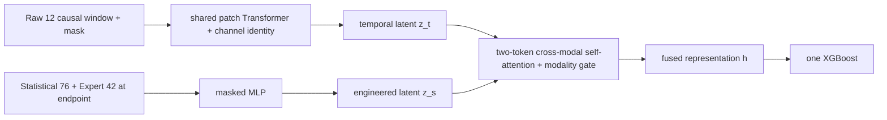

# Clean HTSF under the unified OFP baseline

This directory is a new implementation of HTSF.  It does not extend the old
`OFP/deep_learning/compat/run_patchtst_stat_aligned_xgb.py` runner.  It imports only
the frozen label, three-group feature and evaluator contracts from
`unified_baseline/ofp_unified`.

The goal is not merely to make HTSF run.  The goal is to make every reported
difference attributable to one declared experimental axis.

## Fixed task and views

- Task: predict the first fault within 120 hours.
- Training endpoints: rows strictly before the first fault; a healthy module's
  rows are valid negatives.
- Temporal view: a causal fixed-length window of only the original Raw 12
  channels, with left padding and a per-value validity mask.
- Engineered view: the current endpoint's Statistical 76 + Expert 42 features.
- Statistical history: the complete causal prefix from the start of that SN to
  the endpoint.  It is intentionally longer than the fixed Raw window.
- Rules: only the 38 Expert feature indicators; no decision-time rule `OR`.
- Final classifier: exactly one XGBoost.
- Main threshold: fixed at `0.5`; no hidden validation threshold search.

The three feature classes remain exactly Raw, Statistical and Expert.  A Raw
window is a temporal organization of Raw, not a fourth feature class.



The neural auxiliary linear head supervises Stage A only.  It is removed from
the final decision path.  Stage B freezes the encoder, extracts the selected
representation on the same endpoint manifest, and trains XGBoost.

## Core architecture suite

Every architecture consumes the same saved `(file_name, row_index)` endpoint
manifest.  The suite auditor rejects a comparison when endpoint or weight
hashes differ.

| ID | XGBoost input | Mechanism tested |
|---|---|---|
| H1 `temporal_only` | `z_t`, 128 dimensions | Raw temporal representation |
| H2 `expert_stat_only` | `z_s`, 128 dimensions | Statistical+Expert representation |
| H3 `direct_concat` | projected `[z_t,z_s]`, 128 dimensions | two views without attention/gate |
| H4 `cross_attention` | attention representation, 128 dimensions | attention without a learned gate |
| H5 `htsf_fusion` | gated attention representation, 128 dimensions | complete clean HTSF mechanism |

H1--H5 are the only rows in `architecture_suite.json`.  They expose the same
128-dimensional width to XGBoost, so a larger decision table cannot masquerade
as a fusion gain.

The separate `bridge_suite.json` contains intentionally non-equal controls:

| ID | XGBoost input | Role |
|---|---|---|
| H0 `sampled_b2_xgb` | direct B2, 130 dimensions | same-endpoint non-neural control |
| H5 `htsf_fusion` | fused `h`, 128 dimensions | pure clean HTSF |
| H6 `htsf_fusion_b2_skip` | B2 + `h`, 258 dimensions | nested incremental diagnostic |

H0/H6 are never emitted in the core mechanism-ablation table.  H6 is a
diagnostic, not the pure paper HTSF.

The existing strict B2 and H0 answer different questions:

```text
B2-strict (all valid rows) -> H0 (HTSF endpoint manifest) -> H1...H5
          sampling/scale effect                  representation effect
```

Therefore, `B2-strict -> H0` must be reported before attributing `H0 -> H5` to
the hybrid representation.

## Sampling and weighting are separate suites

- `architecture_suite.json`: sampling=`uniform_per_module`, weighting=`none`;
  only the architecture changes.
- `sampling_suite.json`: full H5 is fixed.  S0 and HSS both allocate up to 40
  endpoints to a faulty SN and 8 to a healthy SN; only the faulty-SN positive/
  negative allocation changes.
- `weighting_suite.json`: H5 + HSS endpoints are fixed; compares none, TPW,
  ANW and TPW+ANW.  These weights supervise only Stage A.  XGBoost remains
  unweighted.

In this clean implementation, S0 draws the matched total quota without label
stratification.  HSS prefers `32` positive and `8` early-negative endpoints for
a faulty module and `8` negatives for a healthy module.  If a faulty trace has
too few endpoints in either stratum, it deterministically backfills from the
other stratum to preserve the same total budget whenever data permit.  The old
feature-dependent signal Top-K is deliberately not hidden inside HSS: it mixed
feature selection with sampling and prevented a one-axis interpretation.

TPW uses

```text
positive_weight = 1 + alpha * (1 - clip(lead_hours / 120, 0, 1))
```

ANW is applied once after the configured warm-up epoch and changes only
negative representation-loss weights using globally min-max normalized
auxiliary scores.  The weighting suite contains none, TPW-only, ANW-only and
TPW+ANW; XGBoost is unweighted in all four rows.

Selected normalized windows and endpoint features are materialized once into
fingerprinted row shards shared by all variants and epochs.  Global row batches
can therefore mix SNs, so Stage A is not accidentally a module-mean objective.
The cache also writes `sampled_feature_activity.csv`, including nonzero counts
for the potentially inactive hard-rule indicators.

## Commands

Install the additional dependency:

```powershell
python -m pip install -r OFP\unified_baseline\htsf\requirements.txt
```

Run all tests:

```powershell
Push-Location OFP\unified_baseline
python -B -m unittest discover -s tests -v
python -B -m unittest discover -s htsf\tests -v
Pop-Location
```

Run a small real-data architecture smoke test:

```powershell
python -B OFP\unified_baseline\htsf\run_htsf.py `
  --suite bridge `
  --experiments H0_sampled_b2_xgb H5_htsf `
  --smoke --folds 1 --device auto --overwrite
```

Run the formal three-fold architecture comparison:

```powershell
python -B OFP\unified_baseline\htsf\run_htsf.py `
  --suite architecture --folds 1 2 3 --device auto --overwrite
```

Run the separate formal baseline bridge/diagnostic:

```powershell
python -B OFP\unified_baseline\htsf\run_htsf.py `
  --suite bridge --folds 1 2 3 --device auto --overwrite
```

After strict B2 and the bridge finish, validate that the bridge changes only
the training endpoint population:

```powershell
python -B OFP\unified_baseline\htsf\validate_bridge.py `
  --strict-b2-manifest OFP\unified_baseline\artifacts\b2_strict_120h\run_manifest.json `
  --sampled-b2-manifest OFP\unified_baseline\htsf\artifacts\bridge_formal\H0_sampled_b2_xgb\run_manifest.json `
  --bridge-suite-manifest OFP\unified_baseline\htsf\artifacts\bridge_formal\suite_manifest.json
```

Run isolated sampling and weighting experiments:

```powershell
python -B OFP\unified_baseline\htsf\run_htsf.py `
  --suite sampling --folds 1 2 3 --device auto --overwrite

python -B OFP\unified_baseline\htsf\run_htsf.py `
  --suite weighting --folds 1 2 3 --device auto --overwrite
```

Scientific settings live in versioned JSON.  The command line intentionally
exposes execution scope, paths, folds and device, rather than dozens of freely
combinable scientific switches.

## Auditable outputs

Each fold records:

- the task/split/data/config/run fingerprints;
- the exact endpoint and final weight fingerprints;
- the saved endpoint CSV and train-only normalizer manifest;
- the representation checkpoint and its gradient-flow declaration;
- the single XGBoost model, configuration and feature manifest;
- predictions for every validation timestamp;
- module decisions and official metrics.

Each suite writes `comparison.csv` only after its one-axis invariants pass.
Smoke and partial runs use different output paths and are not formal evidence.

Running every suite repeats two scientifically identical configurations (H5
uniform/none in architecture and bridge; H5 HSS/none in sampling and
weighting) and writes full per-timestamp predictions for each.  Plan disk and
runtime accordingly; run the core architecture suite first, then only the
additional bridge/gain suites needed for the paper.  Partial experiment lists
are useful for diagnostics but are intentionally ineligible for formal status.

## Verification status

- 26 clean-HTSF tests pass, including a cached synthetic two-stage end-to-end run.
- The existing 30 B0/B1/B2 regression tests still pass unchanged.
- A real fold-1 smoke run of H0 and H5 completed and wrote a valid audited
  comparison.  Its 48-train/12-validation-module numbers are diagnostics only.
- No formal HTSF result is claimed in this repository yet.

See [`PROTOCOL.md`](PROTOCOL.md) for frozen axes,
[`EVIDENCE_PLAN.md`](EVIDENCE_PLAN.md) for the result-table contract, and
[`PAPER_ALIGNMENT.md`](PAPER_ALIGNMENT.md) before updating the manuscript.
