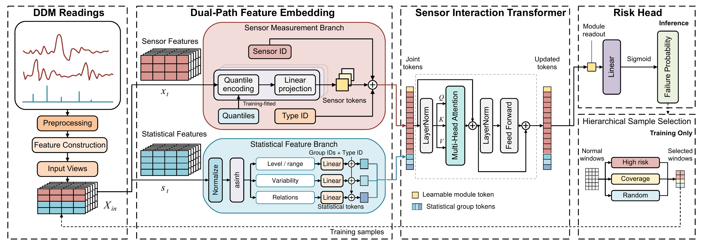

# SSFFN: Sensor and Statistical Feature Fusion Network

Implementation of **SSFFN** for optical-transceiver failure prediction using
Digital Diagnostic Monitoring (DDM) data.

## Framework

[](assets/ssffn-framework.pdf)

The figure is the framework diagram used in the paper. Click it for the PDF.

SSFFN combines a **Sensor Measurement Branch (SMB)** and a **Statistical Feature
Branch (SFB)** through a **Sensor Interaction Transformer (SIT)**. SMB embeds the
12 current sensor measurements. SFB organizes 80 statistical and channel-relation
features into three groups: signal levels, variability, and channel relations.
The learnable module token provides the representation for failure prediction.
**Hierarchical Sample Selection (HSS)** selects informative training windows
under per-transceiver quotas.

## Installation

Use Python 3.11 or later with a suitable CPU or CUDA installation of PyTorch.
Run the following commands from the repository root:

```bash
pip install -r OFP/ssffn/requirements.txt
python -m unittest OFP.ssffn.tests.test_contract -v
```

To check training and inference with synthetic data:

```bash
python -m OFP.ssffn smoke --output output/ssffn_smoke --device cpu
```

This short installation check does not produce paper experiment results.

## Data

Store one CSV per transceiver. Each CSV contains:

- `timestamp`: observation time in Unix seconds.
- `temperature`, `current`, `currentTXPower`, `currentRXPower`.
- `currentMultiRXPower1` through `currentMultiRXPower4`.
- `currentMultiTXPower1` through `currentMultiTXPower4`.
- `anomaly`: the event label, excluded from model inputs; optional for inference.

Keep observations in timestamp order and measurements in the dataset's original
units. Invalid readings are causally forward-filled, with zero used when no
valid observation is available. Raw production data are not included.

Create an index with one row per transceiver. `Label` is its binary failure label:

```csv
file_name,Label
module_001.csv,0
module_002.csv,1
```

We partition transceivers into fixed training and test subsets at an 80:20 ratio,
stratified by failure label, using seed 42. All observations of a transceiver
remain in the same subset. We then perform three-fold cross-validation within
the training subset for model selection and evaluate the selected model on the
fixed test subset. Normalization and quantile encodings use training data only;
alarm thresholds and the fold model are selected by validation F1. Threshold
ties are resolved by AFWS, Precision, Accuracy, Recall, then the larger threshold.

## Training

```bash
python -m OFP.ssffn train \
  --data-dir dataset/training \
  --index dataset/index.csv \
  --output output/ssffn \
  --device cuda
```

The model trains for 16 epochs per fold with batches of 32 modules and ordinary
BCE. SIT uses three layers, hidden dimension 64, four heads, feed-forward
dimension 192, and dropout 0.15. AdamW uses learning rate 0.0003 and weight decay
0.01. HSS retains eight normal windows from at most 64 candidates and refreshes
selection every two epochs. Settings are in
[`configs/ssffn.json`](OFP/ssffn/configs/ssffn.json).

## Component ablations

Add `--all-ablations` to the training command to run SSFFN and all four ablations,
or use `--variant` to run one:

| Argument | Ablation |
|---|---|
| `full` | SSFFN |
| `no_sensor` | Remove SMB tokens |
| `no_statistics` | Remove SFB tokens |
| `no_sit` | Replace SIT with branch-wise mean pooling and equally weighted fusion |
| `no_hss` | Replace HSS with uniform sampling under the same window budget |

Every component variant uses the same data partitions and training budget.

## Prediction and evaluation

The output directory contains `selection.json` for the selected checkpoint and
validation threshold. Use those values when running prediction:

```bash
python -m OFP.ssffn predict \
  --checkpoint path/to/aligned_encoder.pt \
  --data-dir path/to/module_csvs \
  --output output/predictions \
  --threshold 0.5 --device cuda

python -m OFP.ssffn evaluate \
  --predictions output/predictions \
  --labels path/to/labeled_module_csvs \
  --output output/evaluation
```

The threshold `0.5` is an example; use the value in your run's `selection.json`.
Reports contain Precision, Recall, F1, Accuracy, AvgLead in hours, AFWS, and FP.
AFWS is `F1 + Accuracy + tanh(AvgLead_hours)`.

The implementation is in [`OFP/ssffn`](OFP/ssffn): `model.py` defines the model,
`experiment.py` handles training and selection, `inference.py` loads checkpoints,
and `report.py` produces the evaluation tables.


## Baseline models

`OFP/baselines` contains the Rule Model, tree-classifier constructors, and binary
classification adapters for iTransformer, PatchTST, FITS, and ModernTCN.
The adapters accept sensor windows and observation masks with shape `[B,L,12]`.
FITS also returns sensor and frequency attribution tensors after its logits.
Set their configuration explicitly for a comparison experiment. The SSFFN
training command above runs SSFFN and its component ablations.

```python
from OFP.baselines.patchtst import PatchTSTCfg, PatchTSTClassifier
from OFP.baselines.trees import build_tree

model = PatchTSTClassifier(PatchTSTCfg(seq_len=288, n_sensors=12))
forest = build_tree("random_forest", n_estimators=100, random_state=2024)
```

Optional tree dependencies: `pip install -r OFP/baselines/requirements.txt`.
Only required upstream layers are included under `third_party`; their sources
and licenses are listed in [THIRD_PARTY_NOTICES.md](THIRD_PARTY_NOTICES.md).

## License

Project code is distributed under the [MIT License](LICENSE). Third-party
components retain their original copyright notices and licenses.
