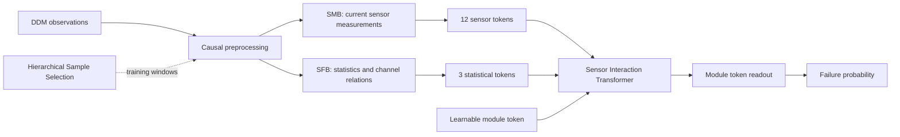

# SSFFN: Sensor and Statistical Feature Fusion Network

Code for optical-transceiver failure prediction from Digital Diagnostic
Monitoring (DDM) measurements. The current paper model is **SSFFN (split3)**.
Its implementation and reproduction entry point are in [`OFP/ssffn`](OFP/ssffn).

## Model

SSFFN processes two complementary inputs with the **Sensor Measurement Branch
(SMB)** and **Statistical Feature Branch (SFB)**. Both are input embeddings; the
model has one **Sensor Interaction Transformer (SIT)** and one prediction head.



- **SMB:** 12 measurements, training-fitted distribution encoding and linear
  token projection. There is no separate temporal encoder or history residual.
- **SFB:** 80 continuous features grouped into three tokens: level/range (36),
  variability/shape (36), and channel relations (8). Threshold-derived features
  are excluded from the model.
- **SIT:** 16 tokens, width 64, three layers, four attention heads, feed-forward
  width 192, and a learnable module token for prediction.
- **Hierarchical Sample Selection (HSS):** per-module quotas and rule-free
  distribution/risk/coverage sampling. Training uses ordinary module-averaged BCE.

## Install and check

Use Python 3.11 or later and a working PyTorch installation. Install the
appropriate PyTorch build for your CPU/CUDA environment, then the small set of
remaining dependencies:

```bash
pip install -r OFP/ssffn/requirements.txt
python -m unittest OFP.ssffn.tests.test_contract -v
python -m OFP.ssffn smoke --output output/ssffn_smoke --device cpu
```

The smoke check creates synthetic data and exercises training, all four module
ablations, HSS refresh, checkpoint loading, and evaluation. Its short runs are
**installation checks, not paper results**. `train` always uses 16 epochs per fold.

## Data

Place one CSV per transceiver under a local directory, for example
`dataset/training`. Each CSV contains `timestamp`, `anomaly` and the 12 DDM sensor
columns listed in the [data specification](OFP/ssffn/docs/DATA.md). `anomaly` is a
target/reference field and is never a model input. An index CSV specifies
`file_name,folder_index,Label`, one row per transceiver.

The release adds no production data, per-module predictions, or trained weights.
Obtain the data through its authorized source. Run commands from the repository
root. A GPU is recommended for full experiments.

## Reproduce the archived paper results

The archived numbers below were produced with **three rotating outer test folds**,
with an 80:20 training/validation split inside each outer training partition.
They are not results on the subsequently defined fixed 20% test set.

```bash
python -m OFP.ssffn train \
  --protocol legacy_cv \
  --data-dir dataset/training \
  --index 'dataset/train_test_set_index(in).csv' \
  --output output/ssffn_legacy_s42 \
  --all-ablations --training-seed 42 --device cuda
```

All three folds are run by default. To run only the main model, omit
`--all-ablations`. Use `--variant no_sensor`, `no_statistics`, `no_sit`, or
`no_hss` for an individual ablation. Use a new output directory for each run.

| Model | Precision | Recall | F1 | Accuracy | AvgLead (h) | AFWS | FP ↓ |
|---|---:|---:|---:|---:|---:|---:|---:|
| SSFFN | **0.928** | **0.558** | **0.697** | **0.851** | 20.671 | **2.548** | **178** |
| w/o SMB | 0.669 | 0.517 | 0.583 | 0.773 | **25.947** | 2.357 | 1050 |
| w/o SFB | 0.921 | 0.557 | 0.695 | 0.850 | 15.273 | 2.544 | 195 |
| w/o SIT | 0.831 | 0.508 | 0.631 | 0.817 | 24.019 | 2.448 | 423 |
| w/o HSS | 0.904 | 0.548 | 0.682 | 0.843 | 21.216 | 2.526 | 239 |

These are pooled module-level results at training seed 42, with 16 epochs for
each of the 15 model/fold combinations. Best values are bold. AvgLead is
conditional on successful detections and should be read alongside Recall.
Exact aggregate and per-fold values are in [`results`](OFP/ssffn/results).
This release has been checked for implementation parity; full production
experiments were not rerun as part of packaging it.

## Fixed 80:20 holdout protocol

For new experiments under the revised split, use:

```bash
python -m OFP.ssffn train \
  --protocol fixed_holdout \
  --data-dir dataset/training \
  --index 'dataset/train_test_set_index(in).csv' \
  --output output/ssffn_fixed_s42 \
  --all-ablations --training-seed 42 --device cuda
```

Transceivers are split 80:20, stratified by failure label, with seed 42. The
training partition has three inner folds. Each fold model trains for 16 epochs;
its alarm threshold is chosen on its validation fold. The fold model with the
highest validation F1 is selected, then evaluated once on the fixed test set.
It is not refitted on all 80% of the data and no test-set ensemble is constructed.
The test partition is excluded from feature normalization and HSS.
**Production results for this new protocol are not included.**

See [PROTOCOL.md](OFP/ssffn/docs/PROTOCOL.md) for split/selection details, the
unchanged float32 timestamp convention, AFWS, and reproduction boundaries.

## Inference and evaluation

Each run writes a self-contained `aligned_encoder.pt`, normalization, split
manifest, validation-selected threshold, training history and seven-metric
reports. Use the chosen threshold from `completed.json` (legacy) or
`selection.json` (fixed holdout):

```bash
python -m OFP.ssffn predict \
  --checkpoint output/ssffn_legacy_s42/full/ssffn/fold_1/aligned_encoder.pt \
  --data-dir path/to/module_csvs --output output/predictions \
  --threshold 0.5 --device cuda

python -m OFP.ssffn evaluate \
  --predictions output/predictions --labels path/to/labeled_module_csvs \
  --output output/evaluation
```

The `0.5` threshold above is an example; use the value selected by your run.
Evaluation reports Precision, Recall, F1, Accuracy, AvgLead in hours, AFWS and FP.
AFWS is `F1 + Accuracy + tanh(AvgLead_hours)` and contains no MinLead term.

## Repository layout

```text
OFP/ssffn/
  model.py              Public model and active-feature interface
  experiment.py         Training, module ablations and protocol orchestration
  inference.py          Self-contained checkpoint loading and CSV prediction
  splits.py             Module-level fixed split and inner folds
  report.py             All seven paper metrics
  configs/split3.json    Full-budget reproduction configuration
  _engine/              Versioned numerical core and compatibility initialization
  docs/                 Data, protocol and release validation notes
  results/              Archived aggregate results, explicitly labeled legacy CV
  tests/                Model, feature, split and metric checks
```

Earlier HTSF, rule/tree baselines and temporal-model benchmarks remain under
`OFP/unified_baseline`, `OFP/model1`, `OFP/model2`, and `OFP/deep_learning`.
They are historical implementations, not the current SSFFN entry point.
The old paper-assets directory also describes an earlier model version.
