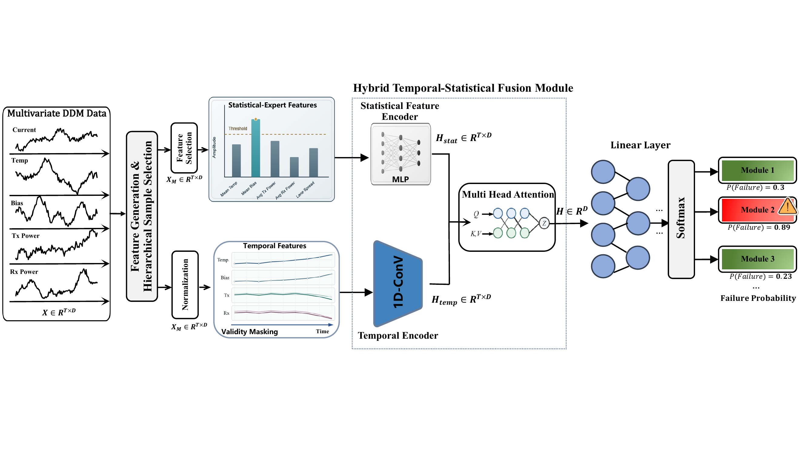

# AIOps / OFP Research Repository

This repository contains the Optical Fault Prediction (OFP) data pipeline,
feature baselines, deep-learning models, evaluation protocols, and paper assets.

## Paper

**A Hybrid Temporal-Statistical Fusion Framework for Optical Transceiver
Failure Prediction**

The paper studies online failure prediction for optical transceivers in
large-scale AI and cloud infrastructure. The task is challenging because
production Digital Diagnostic Monitoring (DDM) data contain rare failures,
large volumes of repetitive normal observations, long-term temporal behavior,
and heterogeneous statistical and physical failure patterns.

## Proposed method: HTSF

We propose the **Hybrid Temporal-Statistical Fusion Framework (HTSF)**. HTSF
models each optical module through two complementary views:

1. **Temporal view** - normalized multivariate DDM windows capture degradation
   trends and dependencies across temperature, bias current, and Tx/Rx power.
2. **Expert-statistical view** - statistical summaries and physically
   meaningful diagnostic features describe operating ranges, variability,
   optical consistency, and lane-level behavior.

A temporal encoder and an MLP project the two views into a shared latent space.
Multi-head attention then learns their cross-view interaction and produces a
unified representation for estimating module failure probability. A
**Hierarchical Sample Selection (HSS)** mechanism reduces redundant normal
windows while preserving scarce and informative pre-failure observations.

## Framework

[](OFP_asp_dac_6pages_1pagereference_/figures/Framework.pdf)

The pipeline starts from multivariate DDM measurements, constructs temporal
and expert-statistical inputs, encodes both branches, fuses them through
multi-head attention, and outputs a failure probability for each module.
Click the figure to open the original publication-quality
[`Framework.pdf`](OFP_asp_dac_6pages_1pagereference_/figures/Framework.pdf).

## Repository layout

```text
OFP/
  model1/                    Legacy Model1 implementation
  model2/                    Model2 rules and engineered features
  unified_baseline/          Reproducible B0/B1/B2 and HTSF experiments
  deep_learning/
    official/                Protocol-aligned training and evaluation pipelines
    compat/                  Model2-compatible adapters
    optical_prediction/      Shared neural model implementations
third_party/
  iTransformer/              Vendored upstream backbone
  ModernTCN/                 Vendored upstream backbone
  PatchTST/                  Vendored upstream backbone
  timesfm/                   Git submodule
dataset/                     Local data (ignored by Git)
```

Generated results, datasets, caches, and local analysis output are excluded
from version control. New maintained code should live under `OFP/`; third-party
source should stay isolated under `third_party/`.

## Main entry points

- Unified baselines: `OFP/unified_baseline/run_experiments.py`
- Clean HTSF: `OFP/unified_baseline/htsf/run_htsf.py`
- Official deep benchmark: `OFP/deep_learning/official/run_official_benchmark.py`
- Model2-compatible deep pipeline: `OFP/deep_learning/compat/run_model2_compat_deep.py`

Run commands from the repository root so package imports and relative data
paths resolve consistently.
